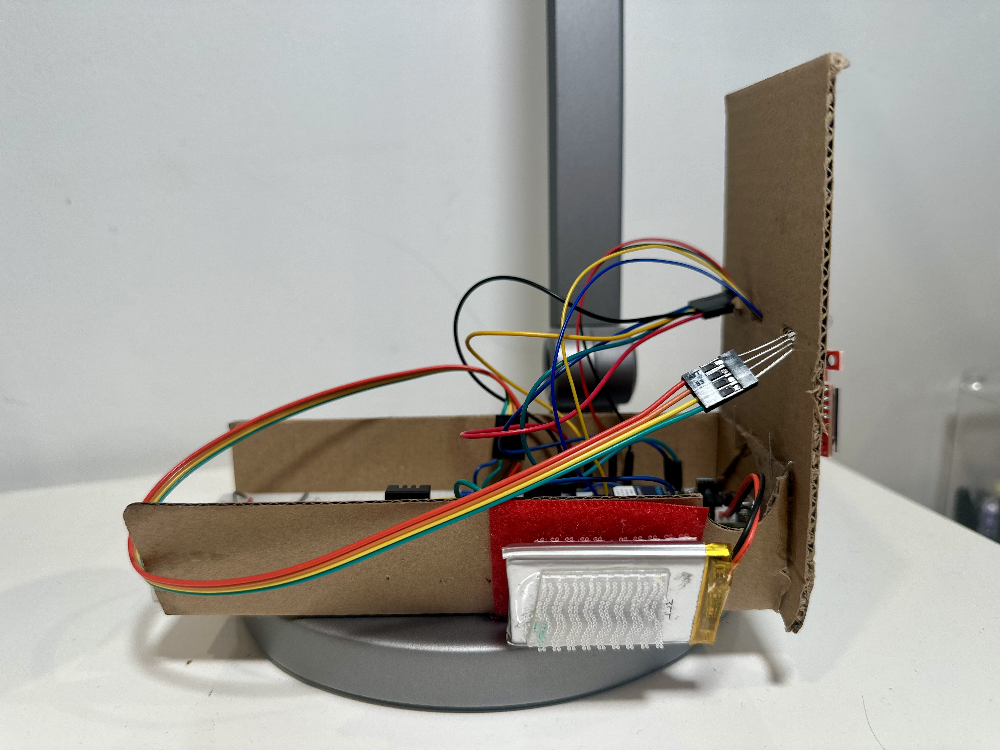
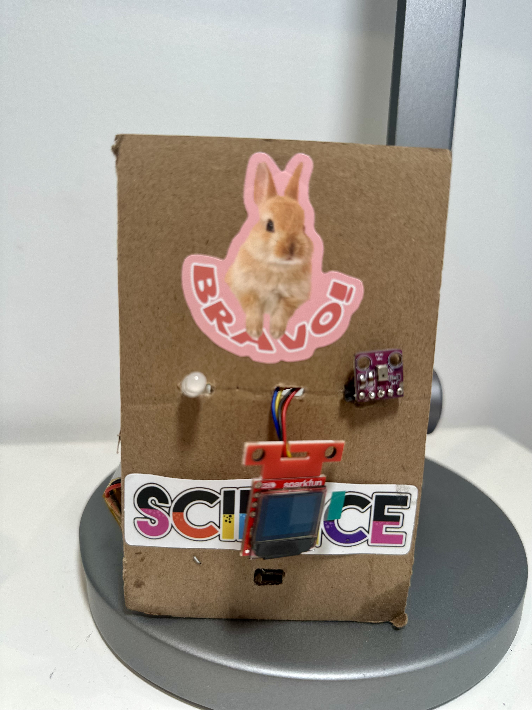
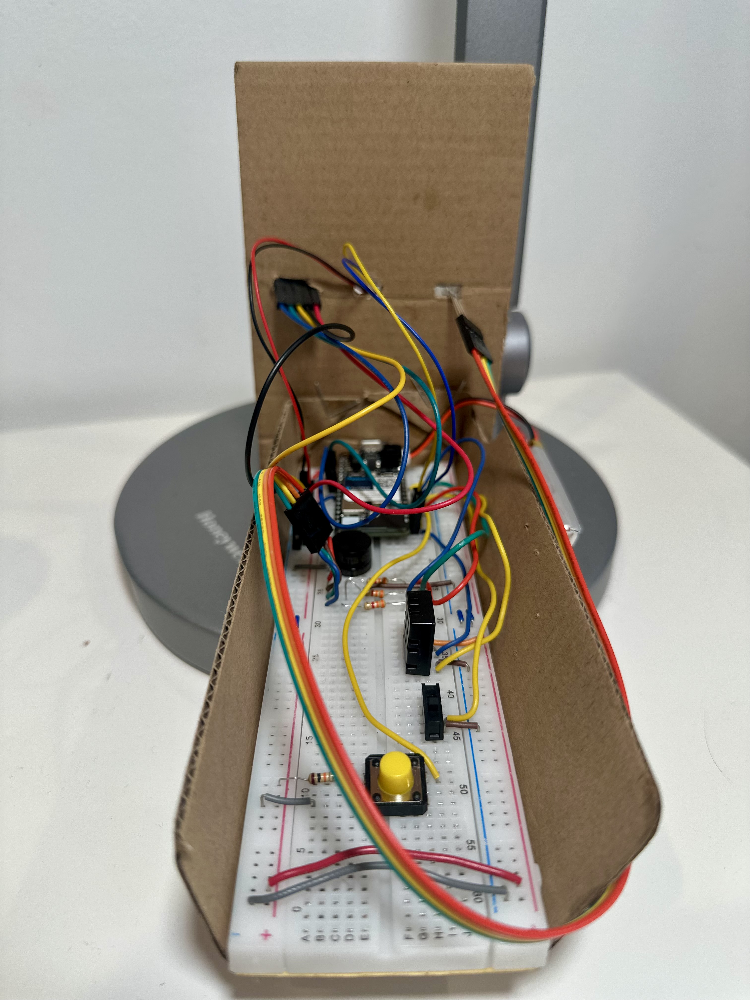
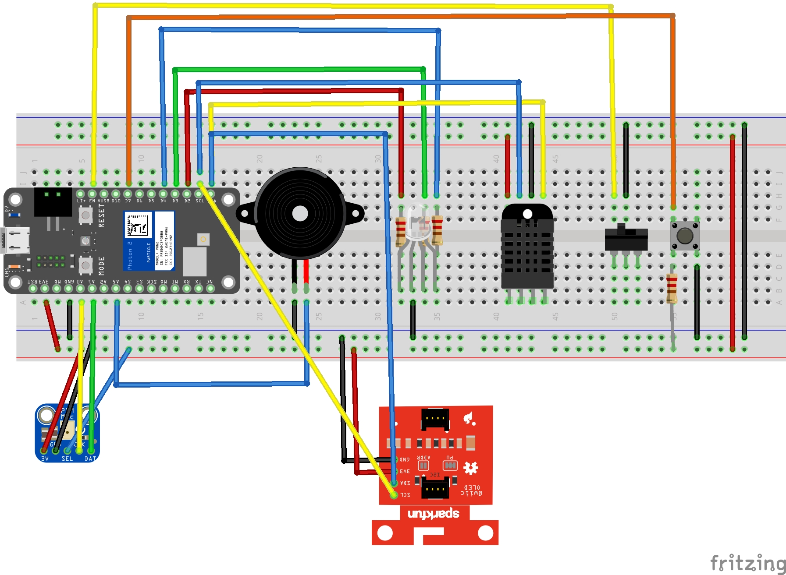

# Cello Analyzer

Performance and environment monitoring for cello practice and instrument care.

`Photon 2` · `PDM Microphone` · `DHT20` · `MicroOLED` · `Initial State` · `Blynk`

## Overview

The Cello Analyzer is an embedded and cloud-connected device designed to support both musical performance and instrument care. It combines a PDM microphone, a DHT20 temperature and humidity sensor, a SparkFun MicroOLED display, an RGB LED, a buzzer, Particle Cloud publishing to Initial State, and a Blynk mobile interface.

The device has two main purposes:

- Monitor live playing dynamics by estimating sound level, classifying volume into musical dynamic markings (`pp`, `p`, `mp`, `mf`, `f`, `ff`), and displaying a waveform on the OLED.
- Monitor cello storage conditions by measuring temperature and humidity, comparing them to safe ranges, and signaling whether the environment is safe, cautionary, or problematic.

This project helps a musician quickly understand how loudly they are playing while also tracking whether the instrument is stored in a healthy environment.

## Features

- Live microphone waveform displayed on the OLED performance page
- Real-time volume estimation from PDM audio samples
- Dynamic classification into `pp`, `p`, `mp`, `mf`, `f`, and `ff`
- RGB LED feedback for both performance and environment states
- Buzzer cue when the dynamic crosses between the soft group (`pp`, `p`, `mp`) and the louder group (`mf`, `f`, `ff`)
- Four OLED pages:
  - Performance
  - Dynamic Trend
  - Current Environment
  - Environment History
- Particle Cloud variables for remote status viewing
- Particle event publishing for Initial State integration
- Blynk dashboard support, including a virtual page-change button

## Hardware Components

| Component | Pin | Purpose |
|---|---|---|
| PDM Microphone | `A0` | Microphone clock signal |
| PDM Microphone | `A1` | Microphone data input |
| RGB LED Red | `D2` | Red channel for visual feedback |
| RGB LED Green | `D3` | Green channel for visual feedback |
| RGB LED Blue | `D4` | Blue channel for visual feedback |
| Piezo Buzzer | `A5` | Audio feedback for dynamic transitions |
| Enable Switch | `D6` | Turns the system on or off |
| Pushbutton | `D7` | Cycles through OLED pages |
| MicroOLED Display | `I2C` | Displays waveform, dynamics, and environment data |
| DHT20 Sensor | `I2C` | Measures temperature and humidity |
| LiPo Battery | `JST battery connector` | Portable power supply |

Prototype views:





## Device Setup

### 1. Wire the hardware

Connect the Photon 2, PDM microphone, DHT20 sensor, MicroOLED display, RGB LED, buzzer, switch, pushbutton, and LiPo battery according to your wiring diagram.



### 2. Open the project in Particle Workbench

- Install Visual Studio Code
- Install the Particle Workbench extension
- Sign into your Particle account
- Connect the Photon 2 by USB
- Use `Particle: Configure Project for Device`
- Select `Photon 2`
- Choose Device OS `6.3.5`

This firmware was developed and tested on Device OS `6.3.5`.

### 3. Install required libraries

The project dependencies are listed in [project.properties](project.properties):

- `ArduinoJson`
- `blynk`
- `DHT20_I2C_Particle`
- `Microphone_PDM`
- `SparkFunMicroOLED`

### 4. Use the serial monitor for debugging

This project prints:

- startup messages
- raw microphone amplitude values
- volume percentages
- dynamic classifications
- DHT20 warnings
- Blynk page-change debugging messages

You can open the serial monitor from Particle Workbench or run:

```bash
particle serial monitor --follow
```

### 5. Configure Initial State

The project uses `Particle.publish()` to send:

- volume
- dynamic level
- temperature
- humidity

These values are combined into a single JSON payload and forwarded to Initial State through a Particle webhook.

### 6. Configure Blynk

Create a Blynk template and device, then copy:

- Template ID
- Template Name
- Auth Token

Paste those into [src/celloanalyzer.cpp](src/celloanalyzer.cpp), then configure Blynk datastreams to match the virtual pins used by the firmware.

## OLED Pages

The OLED interface includes four pages:

1. `Performance`
   - live waveform
   - current dynamic label
   - current volume percentage
2. `Dynamic Trend`
   - percentage of time spent in `pp`, `p`, `mp`, `mf`, `f`, and `ff`
3. `Current Environment`
   - current temperature
   - current humidity
4. `Environment History`
   - temperature high/low
   - humidity high/low

The waveform is drawn on the first page by `drawPerformanceScreen()` in [src/celloanalyzer.cpp](src/celloanalyzer.cpp).

## Cloud Variables and Dashboard

This project uses `Particle.variable()` to expose live device values to the Particle Cloud and `Particle.publish()` with a webhook to send data to the Initial State dashboard.

The project publishes data every `2500 ms` using `millis()`-based timers.

### Initial State event

The event name is:

- `Cello_Analyzer`

The JSON payload is built in `publishInitialStateData()` and has this structure:

```json
[
  {"key":"volume","value":42},
  {"key":"temperature","value":23.2},
  {"key":"humidity","value":55.4},
  {"key":"dynamic","value":"pp"}
]
```

### Dashboard tiles used in Initial State

| Tile Name | Tile Type | Details |
|---|---|---|
| Humidity | Gauge Tile | Displays current humidity with a visible safe-range region |
| Temperature | Gauge Tile | Displays current temperature in Celsius using a thermometer-style visualization |
| Volume | Line Graph Tile | Displays historical trend of volume percentage over time |
| Current Dynamic | Summary Tile | Displays the current dynamic label such as `pp`, `mp`, or `f` |
| Most Frequent Dynamic | Summary Tile | Displays the most commonly occurring dynamic over recorded history |
| Humidity | Line Graph Tile | Displays historical humidity trend over time |
| Temperature | Line Graph Tile | Displays historical temperature trend over time |

### Particle Cloud variables and events

| Event Name / Variable | Details |
|---|---|
| `Cello_Analyzer` | Particle event published to Initial State; includes `volume`, `temperature`, `humidity`, and `dynamic` |
| `mode` | Current page or operating mode |
| `dynamic` | Current musical dynamic label |
| `volume` | Current volume percentage |
| `raw` | Smoothed microphone amplitude before normalization |
| `temp` | Current temperature in Celsius |
| `hum` | Current relative humidity percentage |
| `alert` | Environment alert state: `OK`, `WARN`, `ALERT`, or `ERROR` |
| `celloHealth` | Descriptive cello health message such as `Cello safe`, `Dry air`, `Humid air`, `Too cold`, `Too warm`, or `Sensor err` |

## Blynk Control

The Blynk mobile app provides a phone-based dashboard for monitoring and controlling the Cello Analyzer remotely.

### Blynk datastreams

| Datastream Name | Virtual Pin | Data Type | Suggested Range / Notes |
|---|---|---|---|
| Switch Mode | `V0` | Integer | Min `0`, Max `1` |
| Current Mode | `V1` | String | Displays current OLED mode |
| Dynamic | `V2` | String | Displays current musical dynamic |
| Current Volume | `V3` | Integer | Min `0`, Max `100`, unit `%` |
| Current Temperature | `V4` | String | Displays current temperature |
| Current Humidity | `V5` | String | Displays current humidity |
| Current Health | `V6` | String | Displays cello health message |
| Current Environment | `V7` | String | Displays environment status |
| Dynamic History | `V8` | String | Displays recent dynamic history summary |
| Temp History | `V9` | String | Displays temperature high/low summary |
| Humidity History | `V10` | String | Displays humidity high/low summary |

### Suggested mobile widgets

| Virtual Pin | Purpose | Suggested Widget |
|---|---|---|
| `V0` | Virtual page-change button | Button |
| `V1` | Current mode label | Labeled Value |
| `V2` | Current dynamic label | Labeled Value |
| `V3` | Current volume percent | Display |
| `V4` | Current temperature | Display |
| `V5` | Current humidity | Display |
| `V6` | Cello health message | Display |
| `V7` | Environment alert level | Display |
| `V8` | Dynamic history summary string | Display |
| `V9` | Temperature high/low summary string | Display |
| `V10` | Humidity high/low summary string | Display |

Mode and dynamic are sent to Blynk as strings because they are text labels. Temperature and humidity are also currently formatted as simple display values, though they could be converted to numeric datastreams for gauges and charts.

## Code Summary

The firmware is organized into the following major sections:

- Variables and Libraries
- Microphone and Volume Processing
- RGB LED and Buzzer Feedback
- OLED Functions
- Environment Sensing
- Setup
- User Input and Mode Changes
- Cloud and Mobile Output
- Main Loop

The code is located in [src/celloanalyzer.cpp](src/celloanalyzer.cpp).

## Timing Intervals

Important timing values in the current firmware:

- OLED update interval: `2500 ms`
- Blynk update interval: `2500 ms`
- Initial State publish interval: `2500 ms`
- DHT20 read interval: `2500 ms`
- Serial raw print interval: `1000 ms`
- Button debounce interval: `200 ms`
- Dynamic max decay check interval: `8000 ms`

## Desktop Dashboard

A PySide6 desktop version of the project is included in [desktop_dashboard](desktop_dashboard).


It provides:

- live waveform visualization
- current volume and dynamic display
- temperature and humidity monitoring
- an OLED-style preview panel
- mock data mode for UI testing
- serial data source scaffolding for Photon 2 integration
- session recording and CSV export

Run instructions are available in [desktop_dashboard/README.md](desktop_dashboard/README.md).

## Repository Files

- [src/celloanalyzer.cpp](src/celloanalyzer.cpp)
  - main firmware
- [project.properties](project.properties)
  - Particle project dependencies
- [celloanalyzer-developer-documentation.docx](celloanalyzer-developer-documentation.docx)
  - full developer documentation
- [desktop_dashboard](desktop_dashboard)
  - PySide6 desktop dashboard application

## Future Improvements

- Add manual calibration for different instruments
- Improve cloud update speed while keeping webhook reliability
- Use a more specialized platform for richer audio signal analysis
- Test more microphone sensors
- Expand the environment system to control external hardware such as humidifiers or dryers
- Improve battery efficiency and power management
- Replace prototype wiring with a custom PCB

## Video and Acknowledgements

Sizzle reel / product highlight video:

- [YouTube Demo](https://youtu.be/3P5HkDhI3mo)

Acknowledgements:

- Professor Robert Parke and the TAC 348 teaching team
- Lincoln, Fion, Ilce, and Matt for debugging and setup help
- The Particle community PDM microphone discussion
- The `Microphone_PDM` library repository

## Copyright

Copyright (c) 2026 wuisabel-gif. All rights reserved.
