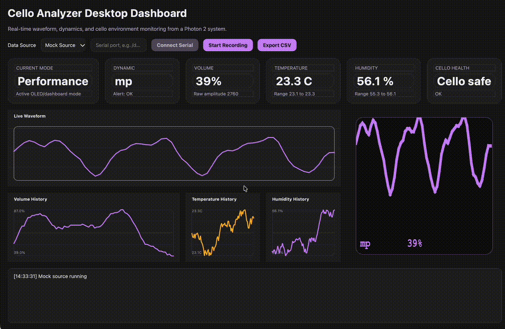

# Cello Analyzer Desktop Dashboard

PySide6 desktop application for monitoring a Photon 2 based Cello Analyzer in real time.



## Features

- Live waveform graph
- Volume meter and dynamic label
- Temperature and humidity monitoring
- OLED-style preview panel
- Session recording in memory
- CSV export
- Mock data mode for UI development
- Serial mode scaffold for live device integration

## Run

```bash
python3 -m venv .venv
source .venv/bin/activate
pip install -r desktop_dashboard/requirements.txt
python3 -m desktop_dashboard.main
```

## Data Sources

- `Mock Source`
  - generates realistic cello-like performance and environment data for testing the UI
- `Serial Source`
  - scaffold for reading line-based data from a Photon 2 over USB serial
  - supports JSON lines and the current `Amp: ... | Vol: ... | Dyn: ...` serial format

## Copyright

Copyright (c) 2026 wuisabel-gif. All rights reserved.
